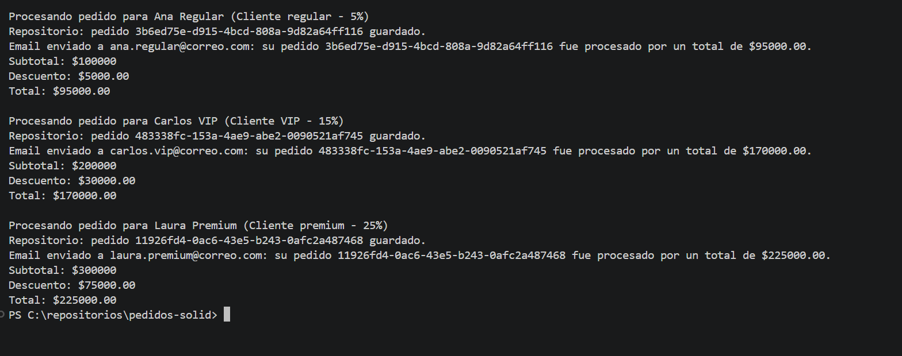

# pedidos-solid

## Descripcion

`pedidos-solid` es una aplicacion Java academica para la actividad **GA1-AA1-EV03 - Aplicacion de principios SOLID y representacion conceptual de patrones GoF y EIP**.

El proyecto modela un caso de uso de procesamiento de pedidos. El servicio principal calcula el descuento con una politica intercambiable, guarda el pedido mediante un repositorio abstracto y envia una notificacion mediante un puerto de salida.

## Objetivo

Demostrar la aplicacion correcta de los cinco principios SOLID en un proyecto Java organizado por capas cercanas a Clean Architecture:

- Dominio independiente de infraestructura.
- Caso de uso expresado mediante una interfaz de entrada.
- Dependencias hacia abstracciones.
- Politicas de descuento intercambiables por polimorfismo.
- Extensibilidad sin modificar el servicio principal.

## Estructura del proyecto

```text
pedidos-solid
|-- pom.xml
|-- README.md
`-- src/main/java/com/pedidossolid
    |-- Main.java
    |-- application
    |   |-- usecase
    |   |   `-- ProcesarPedidoUseCase.java
    |   `-- service
    |       `-- ProcesarPedidoService.java
    |-- domain
    |   |-- model
    |   |   |-- Cliente.java
    |   |   `-- Pedido.java
    |   |-- repository
    |   |   `-- PedidosRepository.java
    |   |-- notification
    |   |   `-- NotificadorPedido.java
    |   `-- discount
    |       |-- PoliticaDescuento.java
    |       |-- DescuentoClienteRegular.java
    |       |-- DescuentoClienteVip.java
    |       `-- DescuentoClientePremium.java
    `-- infrastructure
        |-- repository
        |   `-- PedidosRepositoryEnMemoria.java
        `-- notification
            `-- NotificadorPedidoEmail.java
```

## Principios SOLID aplicados

### 1. Single Responsibility Principle

Cada clase tiene una unica responsabilidad:

- `Cliente` representa datos del cliente.
- `Pedido` representa datos y reglas basicas del pedido.
- `ProcesarPedidoService` orquesta el caso de uso.
- `PedidosRepositoryEnMemoria` se encarga de persistencia en memoria.
- `NotificadorPedidoEmail` se encarga de notificar.
- Cada clase de descuento calcula un unico tipo de descuento.

### 2. Open/Closed Principle

`ProcesarPedidoService` esta cerrado para modificacion y abierto para extension. Para agregar un nuevo descuento no se modifica el servicio; basta crear otra implementacion de `PoliticaDescuento`.

Ejemplo incluido:

- `DescuentoClientePremium`

Esta politica se agrego sin cambiar la logica del servicio principal.

### 3. Liskov Substitution Principle

Cualquier implementacion de `PoliticaDescuento` puede usarse donde el servicio espera esa abstraccion:

- `DescuentoClienteRegular`
- `DescuentoClienteVip`
- `DescuentoClientePremium`

Todas respetan el contrato: reciben un subtotal y devuelven un descuento valido.

### 4. Interface Segregation Principle

Las interfaces son pequenas y especificas:

- `ProcesarPedidoUseCase` solo define el caso de uso.
- `PedidosRepository` solo define persistencia de pedidos.
- `NotificadorPedido` solo define notificacion.
- `PoliticaDescuento` solo define calculo y descripcion del descuento.

No existe una interfaz grande que obligue a implementar metodos innecesarios.

### 5. Dependency Inversion Principle

`ProcesarPedidoService` depende de abstracciones:

- `PedidosRepository`
- `NotificadorPedido`
- `PoliticaDescuento`

Las dependencias se inyectan por constructor o por parametro del caso de uso. El servicio no instancia clases concretas de infraestructura ni politicas especificas.

## Explicacion de cada clase

- `ProcesarPedidoUseCase`: puerto de entrada de la aplicacion. Define la operacion para procesar un pedido.
- `ProcesarPedidoService`: implementa el caso de uso. Calcula descuento, crea pedido, guarda y notifica.
- `Cliente`: modelo de dominio con nombre y correo electronico.
- `Pedido`: modelo de dominio con id, cliente, subtotal, descuento y total.
- `PedidosRepository`: puerto de salida para persistir pedidos.
- `PedidosRepositoryEnMemoria`: implementacion concreta de repositorio usando una lista en memoria.
- `NotificadorPedido`: puerto de salida para enviar notificaciones.
- `NotificadorPedidoEmail`: implementacion concreta que simula envio de correo por consola.
- `PoliticaDescuento`: contrato para cualquier politica de descuento.
- `DescuentoClienteRegular`: aplica 5% de descuento.
- `DescuentoClienteVip`: aplica 15% de descuento.
- `DescuentoClientePremium`: aplica 25% de descuento y demuestra extension por OCP.
- `Main`: compone las dependencias y ejecuta escenarios de prueba.

## Diagrama textual de dependencias

```text
Main
  -> ProcesarPedidoUseCase
       -> ProcesarPedidoService
            -> PedidosRepository
                 -> PedidosRepositoryEnMemoria
            -> NotificadorPedido
                 -> NotificadorPedidoEmail
            -> PoliticaDescuento
                 -> DescuentoClienteRegular
                 -> DescuentoClienteVip
                 -> DescuentoClientePremium
            -> Pedido
            -> Cliente
```

Las flechas muestran uso o dependencia. La capa de aplicacion depende de contratos del dominio, mientras infraestructura implementa esos contratos.

## Instrucciones de ejecucion

### Opcion 1: Maven

Requisitos:

- Java 17 o superior.
- Maven 3.8 o superior.

Comandos:

```bash
mvn clean compile
mvn exec:java
```

### Opcion 2: javac

Desde la raiz del proyecto:

```bash
mkdir out
javac -d out $(find src/main/java -name "*.java")
java -cp out com.pedidossolid.Main
```

En PowerShell:

```powershell
New-Item -ItemType Directory -Force -Path out
javac -d out (Get-ChildItem -Recurse -Filter *.java -Path src/main/java).FullName
java -cp out com.pedidossolid.Main
```

## Resultado esperado

La aplicacion procesa tres pedidos:

- Cliente regular con 5% de descuento.
- Cliente VIP con 15% de descuento.
- Cliente premium con 25% de descuento.

Ejemplo de salida:

```text
Procesando pedido para Ana Regular (Cliente regular - 5%)
Repositorio: pedido 123e4567-e89b-12d3-a456-426614174000 guardado.
Email enviado a ana.regular@correo.com: su pedido 123e4567-e89b-12d3-a456-426614174000 fue procesado por un total de $95000.00.
Subtotal: $100000
Descuento: $5000.00
Total: $95000.00

Procesando pedido para Carlos VIP (Cliente VIP - 15%)
Repositorio: pedido 123e4567-e89b-12d3-a456-426614174001 guardado.
Email enviado a carlos.vip@correo.com: su pedido 123e4567-e89b-12d3-a456-426614174001 fue procesado por un total de $170000.00.
Subtotal: $200000
Descuento: $30000.00
Total: $170000.00

Procesando pedido para Laura Premium (Cliente premium - 25%)
Repositorio: pedido 123e4567-e89b-12d3-a456-426614174002 guardado.
Email enviado a laura.premium@correo.com: su pedido 123e4567-e89b-12d3-a456-426614174002 fue procesado por un total de $225000.00.
Subtotal: $300000
Descuento: $75000.00
Total: $225000.00
```

Los identificadores reales cambian en cada ejecucion porque se generan con `UUID.randomUUID()`.

## Posibles extensiones

- Crear `PedidosRepositoryJdbc` para guardar pedidos en una base de datos.
- Crear `NotificadorPedidoSms` o `NotificadorPedidoWhatsApp`.
- Agregar `DescuentoClienteEmpleado` sin modificar `ProcesarPedidoService`.
- Agregar pruebas unitarias para cada politica de descuento.
- Integrar un contenedor de dependencias como Spring Framework.
- Publicar eventos de dominio cuando un pedido sea procesado.

## Representacion conceptual de patrones GoF y EIP

- GoF Strategy: `PoliticaDescuento` y sus implementaciones representan el patron Strategy. El algoritmo de descuento cambia sin modificar el caso de uso.
- GoF Dependency Injection: `ProcesarPedidoService` recibe sus dependencias por constructor.
- EIP Message Channel: `NotificadorPedido` puede entenderse como un canal abstracto para enviar mensajes de confirmacion.
- EIP Message Translator: una futura implementacion podria transformar `Pedido` en un DTO para correo, SMS o cola de mensajes.

## Evidencia de funcionamiento

La aplicación fue ejecutada correctamente procesando pedidos para clientes Regular, VIP y Premium.


